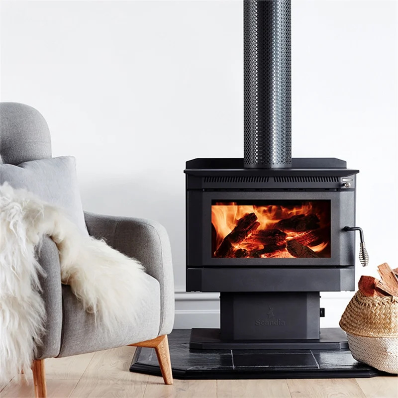

<html>

<body>

 

 
<a href="https://www.bunnings.com.au/scandia-200-warmbrite-indoor-woodfire-heater_p3171489">Scandia 200 Warmbrite Indoor Woodfire Heater</a>
 

<a href="https://ozito.com.au/products/18v-pole-pruner-hedge-trimmer-kit-3-0ah/">PXC 18V POLE PRUNER & HEDGE TRIMMER</a>

